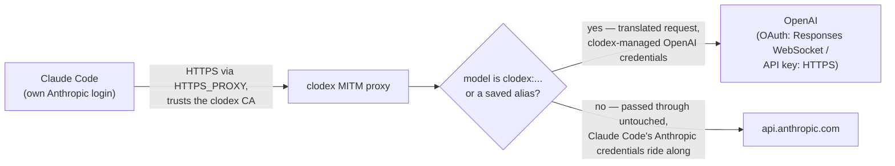
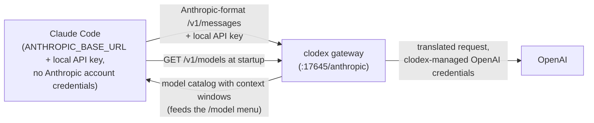

# clodex

**clodex** bridges [Claude Code](https://docs.anthropic.com/en/docs/claude-code) to OpenAI models — with an OpenAI API key or a ChatGPT/Codex-plan OAuth login. It translates Claude Code's Anthropic wire format to the OpenAI API through the Vercel AI SDK, with working prompt caching, accurate context windows and auto-compaction, live mid-session model switching, and an optional Claude Code binary patcher that makes your OpenAI models first-class citizens inside Claude Code (validated names, `/model` entries, correct context reporting).

> clodex is derived from the original [relay-ai](https://github.com/jacob-bd/relay-ai) project, heavily modified and streamlined for this one use case, with the full commit history preserved.

## Get started (ChatGPT/Codex plan)

```bash
npm install -g @bman654/clodex          # 1. install the CLI (Node 22+)
clodex providers auth openai   # 2. sign in with your ChatGPT/Codex plan (device-code OAuth)
clodex models                  # 3. pick favorite models and short aliases
clodex patch                   # 4. (optional) patch Claude Code so those models are first-class
clodex claude                  # 5. launch Claude Code on an OpenAI model
```

1. **Install** — puts the `clodex` command on your PATH.
2. **Sign in** — opens a device-code OAuth flow for your ChatGPT/Codex plan; the token is stored in your OS credential store. (API-key users: `clodex providers add` instead.)
3. **Pick models** — an interactive manager for favorites (max 20) and short aliases like `sol`. Favorites drive the `/model` switch menu, proxy-mode routing, and the patcher.
4. **Patch** *(optional but recommended for proxy mode)* — bakes your favorites and aliases into the Claude Code binary so they pass model validation, appear in `/model`, and report their real context windows. Re-run after each `claude` update; `clodex patch --restore` undoes it.
5. **Launch** — starts Claude Code bridged to the model you choose.

## Bridge modes

Both `clodex claude` and `clodex server` support two bridge modes. A mode flag applies to **that run only**; to change a command's default, add `--save-mode` (e.g. `clodex claude --endpoint --save-mode`). With no flag and nothing saved, both commands default to **proxy** mode, which works with your existing Claude auth.

- **`--proxy`** (the default): a selective man-in-the-middle proxy for `api.anthropic.com`. Claude Code keeps its normal Anthropic login — Anthropic models work untouched — while models named `clodex:<provider-id>:<model-id>` (or their saved aliases) route to OpenAI. Switch with `/model clodex:openai-oauth:gpt-5.6-sol` or `/model sol` after patching.
- **`--endpoint`**: clodex runs a local Anthropic-format gateway and launches Claude Code with `ANTHROPIC_BASE_URL` pointed at it. All traffic goes through the gateway. With favorites saved, the gateway is multi-route and Claude Code's `/model` menu lists your starting model plus favorites for live switching.

In proxy mode, Claude Code keeps its own Anthropic credentials and only requests naming a `clodex:` model or alias are rerouted:



In endpoint mode, no Anthropic account is involved — Claude Code is launched pointing at the local gateway with a local API key, and its startup `/v1/models` fetch powers the `/model` menu:



Using Claude Code's agents view or background agents? Ask your Claude Code agent to read [docs/background-agents.md](docs/background-agents.md) and set it up for you — one global `clodex server --proxy` plus the `clodex-claude` wrapper bin bridges every claude process automatically.

## CLI reference

### `clodex claude [options] [claude-flags]`

Launch Claude Code bridged to OpenAI models. Unrecognized flags (and everything after `--`) pass through to Claude Code (`-c`, `--resume`, `--print`, …).

| Flag | Effect |
| --- | --- |
| `--endpoint` | Endpoint bridge mode for this run: local gateway + `ANTHROPIC_BASE_URL` |
| `--proxy` | Proxy bridge mode for this run: keep Claude Code's Anthropic auth; `clodex:` models route to OpenAI (default when nothing is saved) |
| `--save-mode` | With `--endpoint`/`--proxy`: save that mode as the `claude` default |
| `--dry-run` | Run the wizard but print a launch preview instead of launching (never persists anything) |
| `--trace` | Write debug logs to `~/.clodex/logs/` and show errors on exit |
| `--provider <id>` | Boot provider id (`openai` or `openai-oauth`); with `--model`, skips the wizard |
| `--model <id>` | Boot model id; with `--provider`, skips the wizard |
| `--help`, `--version` | Help / version |

Notes:

- Claude Code may save the launched model to `~/.claude/settings.json`, so bare `claude` later can still show a clodex model name. Reset with `claude --model sonnet`.
- Non-interactive stdin reuses your last provider/model instead of showing the wizard.

### `clodex server [options]`

Foreground gateway, same two bridge modes, no Claude Code launch — point any Anthropic-format (or OpenAI-format) client at it.

Common options (both modes):

| Flag | Effect |
| --- | --- |
| `--endpoint` | Endpoint mode for this run: Anthropic-format HTTP gateway |
| `--proxy` | Proxy mode for this run: selective `api.anthropic.com` MITM proxy (default when nothing is saved; local only) |
| `--save-mode` | With `--endpoint`/`--proxy`: save that mode as the `server` default |
| `--port <1-65535>` | Listen port (default 17645) |
| `--ws-diagnostics` | Log sanitized request envelopes and WebSocket head decisions |
| `--help`, `--version` | Help / version |

Endpoint mode only (an error if combined with `--proxy`):

| Flag | Effect |
| --- | --- |
| `--quick`, `--saved` | Start immediately from saved/default settings, skipping the wizard |
| `--listen local\|network` | One-run listen mode override |
| `--providers all\|favorites\|id1,id2` | One-run provider catalog override |
| `--mask-gateway-ids` / `--no-mask-gateway-ids` | Mask or expose vendor names in discovery model ids (see below) |
| `--password <value>` | One-run network-mode server password |

Proxy mode has no extra options — it takes only the common options.

Bare `clodex server` uses the saved default mode (proxy if none saved). Proxy mode starts immediately. Endpoint mode on a TTY opens a short wizard — start from saved settings, or configure: favorites-only catalog?, which providers to expose, discovery-id masking, and listen local/network (network asks for a password). Without a TTY (or with `--quick`/any endpoint-mode option) it skips all prompts and starts from saved settings; network mode then needs a saved password or `--password`.

**`--mask-gateway-ids`:** endpoint-mode discovery ids look like `anthropic-openai-oauth__gpt-5.6`. Some Claude clients validate model names (Claude Desktop / Cowork pickers, Claude Code skill/agent `model:` frontmatter) and reject or filter ids containing non-Anthropic vendor names. Masking reverses the provider and model segments (`anthropic-htuao-ianepo__6.5-tpg`) so vendor strings never appear literally; display names stay readable (`GPT 5.6 (OpenAI)`), and the gateway accepts both masked and unmasked ids in chat requests. Tradeoff: masked ids are unreadable — copy them exactly from the printed catalog. Masking is on by default; use `--no-mask-gateway-ids` for clients that don't need it.

Endpoint-mode endpoints (default port 17645):

```
ANTHROPIC_BASE_URL=http://127.0.0.1:17645/anthropic
OPENAI_BASE_URL=http://127.0.0.1:17645/openai/v1
```

Use any API key locally; network mode requires the server password. Proxy mode prints `HTTPS_PROXY`, `HTTP_PROXY`, and `NODE_EXTRA_CA_CERTS` values to export — do **not** set `ANTHROPIC_BASE_URL` in that mode.

Examples:

```bash
# Endpoint gateway serving only your favorites, no prompts, for a local client
clodex server --endpoint --quick --providers favorites

# Proxy mode for an existing-auth Claude Code (export the env it prints)
clodex server --proxy
```

### `clodex patch [--restore]`

Patch the installed Claude Code binary so clodex favorites and aliases are first-class: accepted by the Agent tool's model field, listed in `/model`, resolved to their real ids, and reporting the correct context window.

| Flag | Effect |
| --- | --- |
| `--restore` | Restore the pristine (unpatched) Claude Code binary |
| `--trace` | Show the underlying tweakcc output |
| `--help` | Help |

The patch map is built from your favorites and aliases; context windows come from provider metadata. A pristine per-version backup is kept, and a manifest (`~/.clodex/patch-state.json`) makes re-runs no-ops until your config or Claude Code version changes — then the binary is restored first and re-patched fresh. `clodex claude` checks patch freshness at launch and offers to re-patch (a non-blocking notice when not interactive). Re-run `clodex patch` after every `claude` update.

### `clodex models` / `clodex favorites`

Manage favorite models (max 20) and short aliases. Favorites feed the endpoint-mode `/model` switch menu, proxy-mode routing, and the patcher. Saved to `~/.clodex/config.json`.

| Flag | Effect |
| --- | --- |
| *(none)* | Interactive manager: search all providers or browse one at a time |
| `--list` | Print the exact `clodex:<provider-id>:<model-id>` names (and aliases) without opening the manager |
| `--alias <name=target>` | Save a short name for a favorite, e.g. `--alias sol=clodex:openai-oauth:gpt-5.6-sol` (the `clodex:` prefix is optional in the target) |
| `--unalias <name>` | Remove a saved short name |
| `--help`, `--version` | Help / version |

### `clodex providers [subcommand]`

| Subcommand | Effect |
| --- | --- |
| *(none)* | Provider hub wizard |
| `add` | Add OpenAI with an API key (choose OAuth or API key) |
| `auth openai` | Sign in with ChatGPT/Codex-plan OAuth (device code) |
| `list` | Show configured providers |
| `remove <id>` | Remove a provider by id |
| `refresh-models [id]` | Update cached model lists |

Providers supported: `openai` (API key, platform.openai.com) and `openai-oauth` (ChatGPT/Codex plan).

### Root

```
clodex --help       # overview of all commands
clodex --version    # version
```

## Configuration

- Config home: `~/.clodex` (override with `CLODEX_HOME`). On first run, config is migrated automatically from a legacy `~/.relay-ai` directory if present; the legacy directory is never modified.
- Credentials live in the OS credential store (Keychain / Windows Credential Manager / Secret Service) under the `clodex` service.
- `CLODEX_CLAUDE_PATH` overrides Claude Code binary discovery.
- **Outbound proxy:** when `HTTP_PROXY`/`HTTPS_PROXY` (and optionally `NO_PROXY`) are set in clodex's environment, all clodex-originated network calls honor them — OAuth sign-in and token refresh, model-list and models.dev refreshes, upstream OpenAI API calls, and the ChatGPT/Codex OAuth WebSocket transport (tunneled via HTTP CONNECT).

## Known limitations

- Cost display inside Claude Code is inaccurate for OpenAI models (Claude Code applies its own pricing table).
- In the endpoint-mode switch menu, the displayed context window reflects the launch model and does not update on live `/model` switches (Claude Code fetches window metadata once at startup). Proxy mode with `clodex patch` reports correct per-model windows.
- ChatGPT/Codex OAuth requires `store:false` upstream; some OpenAI cache controls are intentionally omitted on OAuth routes because they returned empty responses during compatibility testing.

## License

MIT — see [LICENSE](LICENSE).
